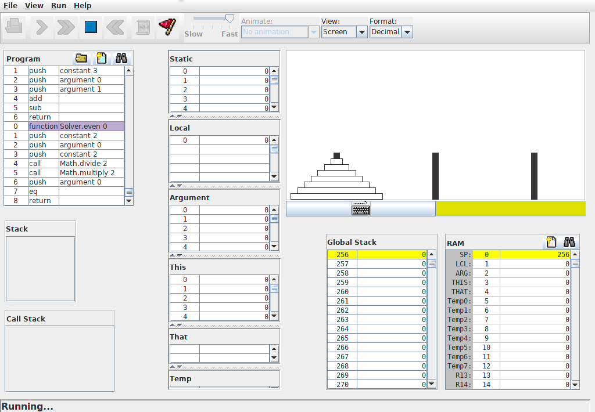
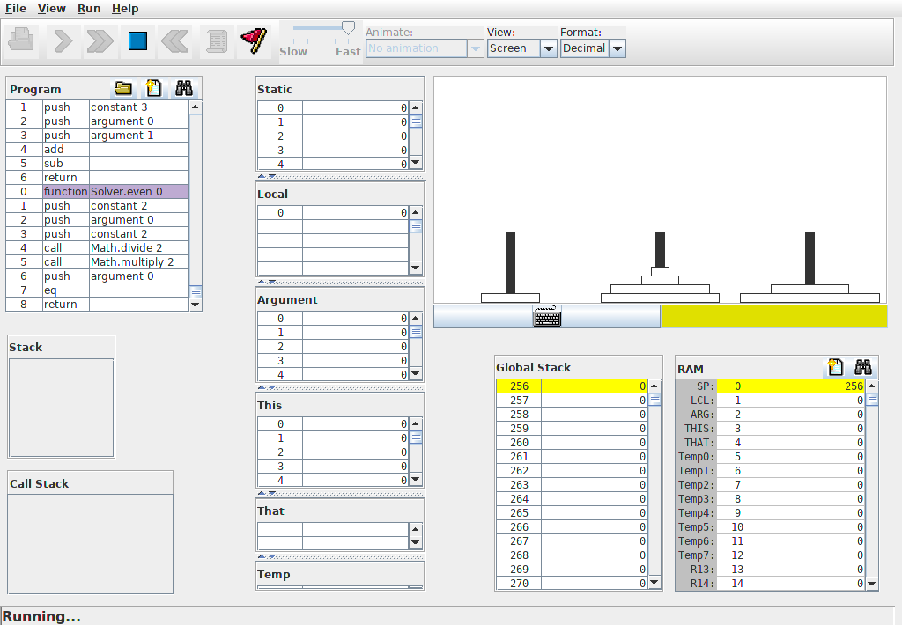
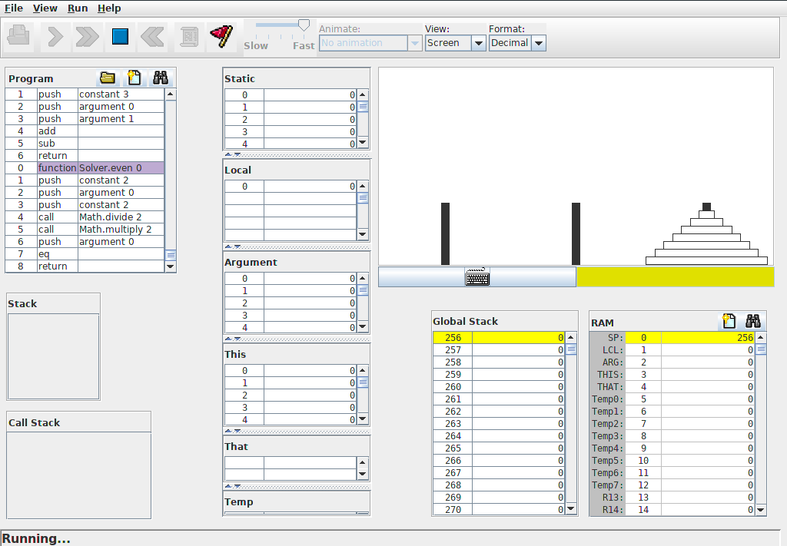

# Tower of Hanoi

A [Tower of Hanoi](https://en.wikipedia.org/wiki/Tower_of_Hanoi) puzzle game for
[project 9](https://www.nand2tetris.org/project09) of [nand2tetris](https://www.nand2tetris.org). Written in the
(made up) Jack language. Can be compiled, using the Jack compiler, to VM byte code, which can be run on the Hack
platform using the nand2tetris VM emulator (see https://www.nand2tetris.org/software).

This Jack program is a good example of how the Hack platform and Jack compiler can handle object-oriented code
involving simple recursive algorithms and common data structures (namely stacks and queues) as well as simple graphics
manipulations.

## Controls

Pegs are numbered 1, 2, 3 starting from left to right.
There are two modes of operation: *play mode* and *solve mode*.
The controls are as follows:

* 1, 2, 3 (no disk selected): Select the top disk of peg 1, 2, 3
* 1, 2, 3 (disk is selected): Move the selected disk to the top of peg 1, 2, 3
* Enter (in play mode): Enter solve mode
* Space (in solve mode): Step through solution
* Enter (in solve mode): Autosolve
* Esc: Exit

## Images

<table style="width:100%">
	<!-- Images -->
	<tr><td></td></tr>
	<!-- Captions -->
	<tr><td>Initial configuration</td></tr>
	<!-- Images -->
	<tr><td></td></tr>
	<!-- Captions -->
	<tr><td>Intermediate configuration</td></tr>
	<!-- Images -->
	<tr><td></td></tr>
	<!-- Captions -->
	<tr><td>Final configuration</td></tr>
</table>

## Extensions

One of the most obvious improvements that could be made is the following:

* The result of the second recursive call in the solution algorithm could be much more efficiently
  obtained via the substitution `from` --> `other` --> `to` --> `from` in the result of the first
  recursive call.
